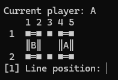

# point-game

## In progress game

## How to play
TODO

## How to run
TODO

## Goal
Create point game, using only with basic language programing c++, cannot use functions, vector and matrix.

## Descriptions variables

| Variable     | type | Descrption                                       |
|--------------|------|--------------------------------------------------|
| player_l?_y? | char | add what player marked point position in axle Y  |
| player_l?_x? | char | add what player marked point position in axle X  |
| ax_l?_?      | char | add character to display arrow in axle X         |
| ay_el?_?     | char | add character to display arrow in axle Y         |
| square_el?_? | char | add character to display player owner squad      |